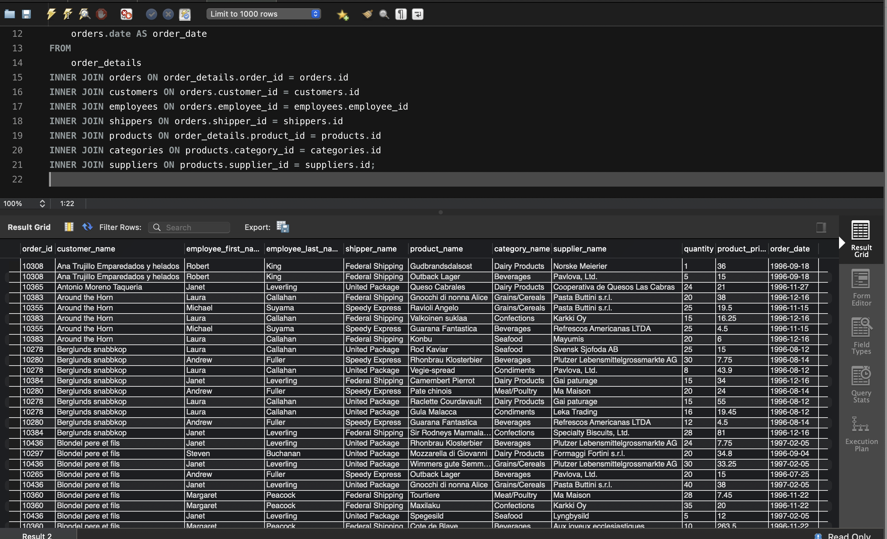
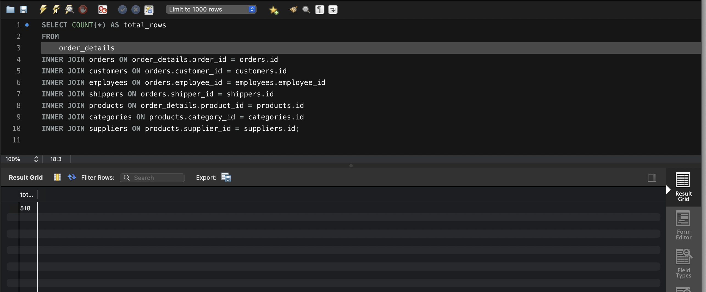
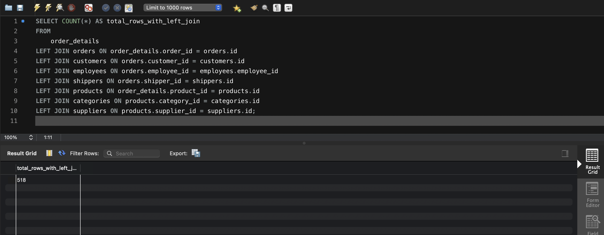
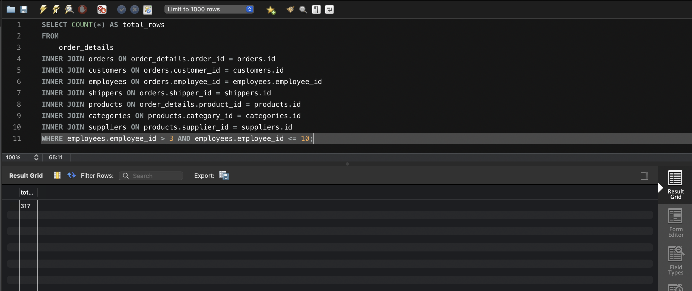
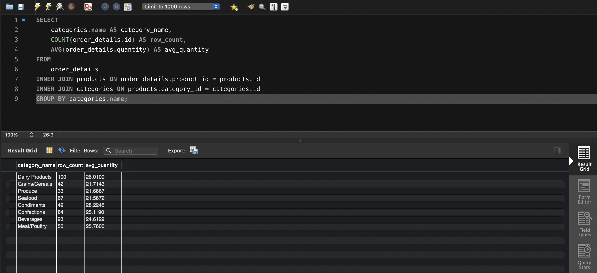
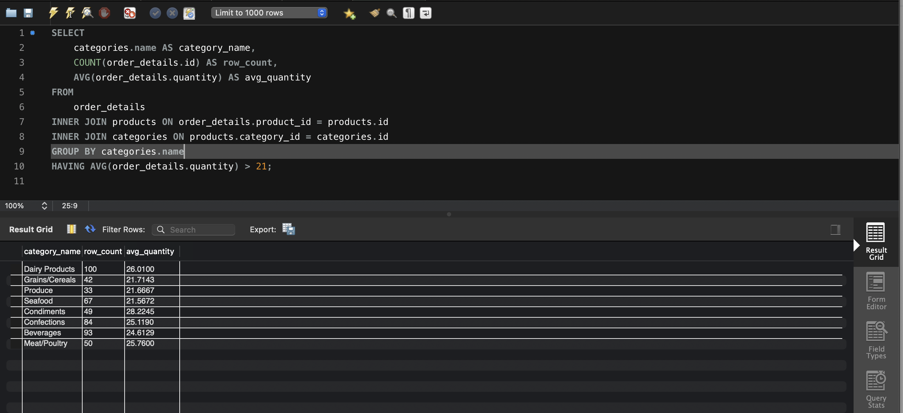
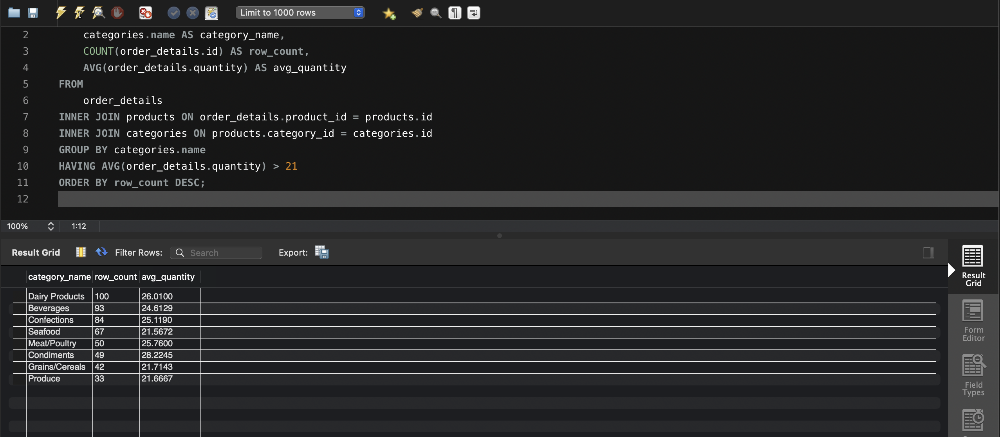
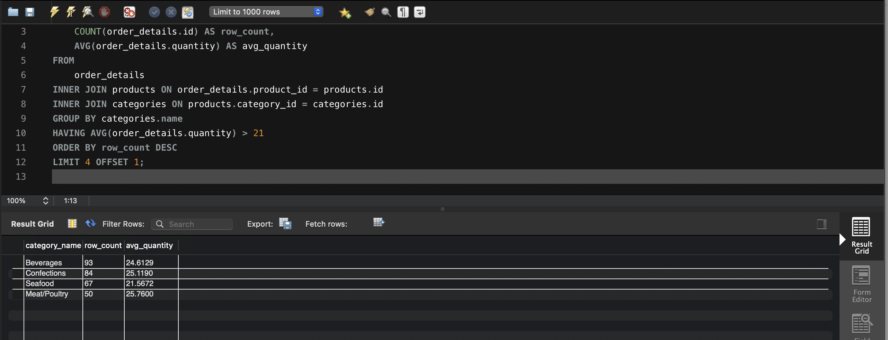

### Завдання 1
1. Створення бази даних
```sql
CREATE DATABASE LibraryManagement;
```
2. Використання бази даних
```sql
USE LibraryManagement;
```
3. Створення таблиць
```sql
CREATE TABLE authors (
    author_id INT AUTO_INCREMENT PRIMARY KEY,
    author_name VARCHAR(255) NOT NULL
);

CREATE TABLE genres (
    genre_id INT AUTO_INCREMENT PRIMARY KEY,
    genre_name VARCHAR(255) NOT NULL
);

CREATE TABLE books (
    book_id INT AUTO_INCREMENT PRIMARY KEY,
    title VARCHAR(255) NOT NULL,
    publication_year YEAR NOT NULL,
    author_id INT,
    genre_id INT,
    FOREIGN KEY (author_id) REFERENCES authors(author_id),
    FOREIGN KEY (genre_id) REFERENCES genres(genre_id)
);

CREATE TABLE users (
    user_id INT AUTO_INCREMENT PRIMARY KEY,
    username VARCHAR(255) NOT NULL,
    email VARCHAR(255) NOT NULL
);

CREATE TABLE borrowed_books (
    borrow_id INT AUTO_INCREMENT PRIMARY KEY,
    book_id INT,
    user_id INT,
    borrow_date DATE NOT NULL,
    return_date DATE,
    FOREIGN KEY (book_id) REFERENCES books(book_id),
    FOREIGN KEY (user_id) REFERENCES users(user_id)
);
```

### Завдання 2
Вставка даних в таблиці
```sql
INSERT INTO authors (author_name)
VALUES 
('George Orwell'),
('J.K. Rowling');

INSERT INTO genres (genre_name)
VALUES 
('Dystopian'),
('Fantasy');

INSERT INTO books (title, publication_year, author_id, genre_id)
VALUES 
('1984', 1949, 1, 1),
('Harry Potter and the Philosopher\'s Stone', 1997, 2, 2);

INSERT INTO users (username, email)
VALUES 
('john_doe', 'john.doe@example.com'),
('jane_smith', 'jane.smith@example.com');

INSERT INTO borrowed_books (book_id, user_id, borrow_date, return_date)
VALUES 
(1, 1, '2024-11-01', '2024-11-10'),
(2, 2, '2024-11-05', NULL); 
```

### Завдання 3
```sql
SELECT 
    orders.id AS order_id,
    customers.name AS customer_name,
    employees.first_name AS employee_first_name,
    employees.last_name AS employee_last_name,
    shippers.name AS shipper_name,
    products.name AS product_name,
    categories.name AS category_name,
    suppliers.name AS supplier_name,
    order_details.quantity,
    products.price AS product_price,
    orders.date AS order_date
FROM 
    order_details
INNER JOIN orders ON order_details.order_id = orders.id
INNER JOIN customers ON orders.customer_id = customers.id
INNER JOIN employees ON orders.employee_id = employees.employee_id
INNER JOIN shippers ON orders.shipper_id = shippers.id
INNER JOIN products ON order_details.product_id = products.id
INNER JOIN categories ON products.category_id = categories.id
INNER JOIN suppliers ON products.supplier_id = suppliers.id;
```



### Завдання 4
1. Визначте, скільки рядків ви отримали (за допомогою оператора COUNT):
```sql
SELECT COUNT(*) AS total_rows
FROM 
    order_details
INNER JOIN orders ON order_details.order_id = orders.id
INNER JOIN customers ON orders.customer_id = customers.id
INNER JOIN employees ON orders.employee_id = employees.employee_id
INNER JOIN shippers ON orders.shipper_id = shippers.id
INNER JOIN products ON order_details.product_id = products.id
INNER JOIN categories ON products.category_id = categories.id
INNER JOIN suppliers ON products.supplier_id = suppliers.id;
```


2. Змініть декілька операторів INNER на LEFT чи RIGHT. Визначте, що відбувається з кількістю рядків. Чому?
```sql
SELECT COUNT(*) AS total_rows_with_left_join
FROM 
    order_details
LEFT JOIN orders ON order_details.order_id = orders.id
LEFT JOIN customers ON orders.customer_id = customers.id
LEFT JOIN employees ON orders.employee_id = employees.employee_id
LEFT JOIN shippers ON orders.shipper_id = shippers.id
LEFT JOIN products ON order_details.product_id = products.id
LEFT JOIN categories ON products.category_id = categories.id
LEFT JOIN suppliers ON products.supplier_id = suppliers.id;
```



Пояснення:
 - Використання LEFT JOIN включає всі рядки з таблиці order_details, навіть якщо відповідні дані у зв’язаних таблицях відсутні.
 - Результат може містити більше рядків, оскільки до набору додаються записи з NULL у колонках, які не мають зв’язку.

RIGHT JOIN аналогічний, але починається з таблиці праворуч.

3. Оберіть тільки ті рядки, де employee_id > 3 та employee_id ≤ 10:
```sql
SELECT COUNT(*) AS total_rows
FROM 
    order_details
INNER JOIN orders ON order_details.order_id = orders.id
INNER JOIN customers ON orders.customer_id = customers.id
INNER JOIN employees ON orders.employee_id = employees.employee_id
INNER JOIN shippers ON orders.shipper_id = shippers.id
INNER JOIN products ON order_details.product_id = products.id
INNER JOIN categories ON products.category_id = categories.id
INNER JOIN suppliers ON products.supplier_id = suppliers.id
WHERE employees.employee_id > 3 AND employees.employee_id <= 10;
```



4. Згрупуйте за іменем категорії, порахуйте кількість рядків у групі, середню кількість товару:
```sql
SELECT 
    categories.name AS category_name,
    COUNT(order_details.id) AS row_count,
    AVG(order_details.quantity) AS avg_quantity
FROM 
    order_details
INNER JOIN products ON order_details.product_id = products.id
INNER JOIN categories ON products.category_id = categories.id
GROUP BY categories.name;
```



5. Відфільтруйте рядки, де середня кількість товару більша за 21:
```sql
SELECT 
    categories.name AS category_name,
    COUNT(order_details.id) AS row_count,
    AVG(order_details.quantity) AS avg_quantity
FROM 
    order_details
INNER JOIN products ON order_details.product_id = products.id
INNER JOIN categories ON products.category_id = categories.id
GROUP BY categories.name
HAVING AVG(order_details.quantity) > 21;
```



6. Відсортуйте рядки за спаданням кількості рядків:
```sql
SELECT 
    categories.name AS category_name,
    COUNT(order_details.id) AS row_count,
    AVG(order_details.quantity) AS avg_quantity
FROM 
    order_details
INNER JOIN products ON order_details.product_id = products.id
INNER JOIN categories ON products.category_id = categories.id
GROUP BY categories.name
HAVING AVG(order_details.quantity) > 21
ORDER BY row_count DESC;
```



7. Виведіть на екран (оберіть) чотири рядки з пропущеним першим рядком:
```sql
SELECT 
    categories.name AS category_name,
    COUNT(order_details.id) AS row_count,
    AVG(order_details.quantity) AS avg_quantity
FROM 
    order_details
INNER JOIN products ON order_details.product_id = products.id
INNER JOIN categories ON products.category_id = categories.id
GROUP BY categories.name
HAVING AVG(order_details.quantity) > 21
ORDER BY row_count DESC
LIMIT 4 OFFSET 1;
```


